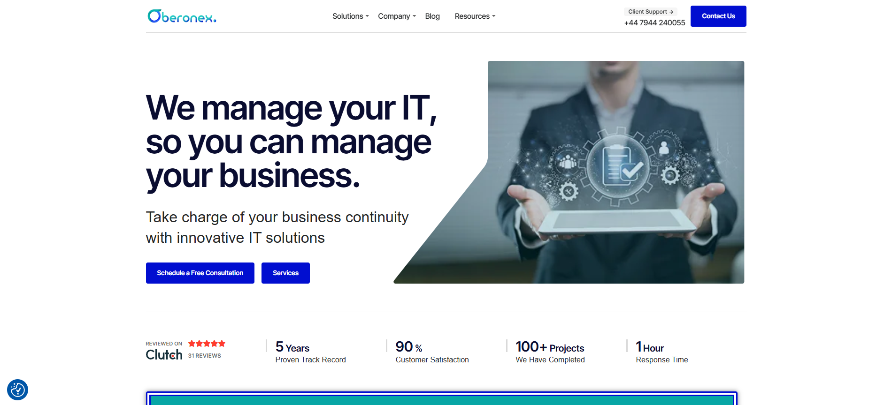
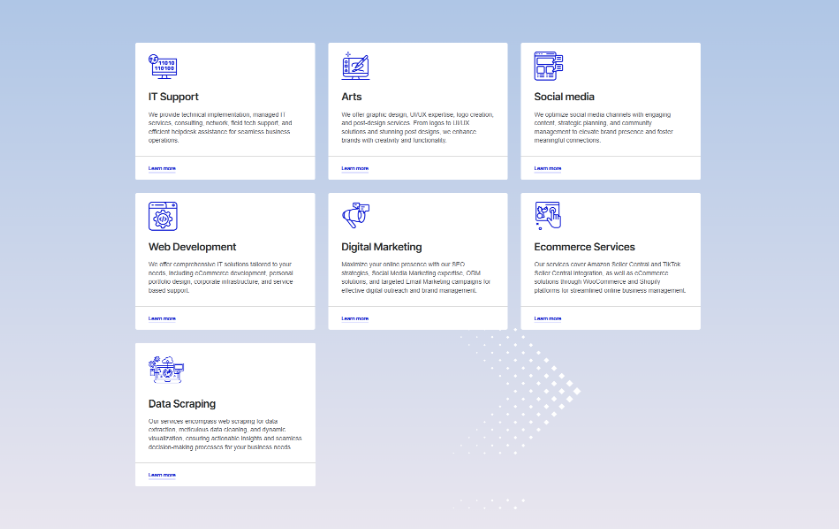
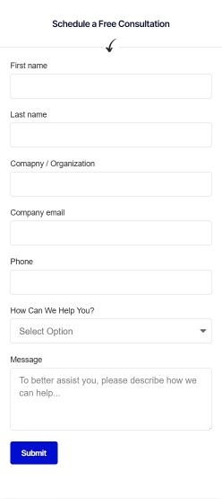

# Oberonex Company Website – Case Study  

This repository contains the case study of the Oberonex corporate website project, built with WordPress and Elementor.  

## Project Overview  
The goal was to create a professional corporate site to represent Oberonex’s brand, services, and portfolio. The design focuses on a clean, modern look, easy navigation, and mobile-friendly responsiveness.  

## Key Features  
- Fully responsive design  
- Service-focused layout with clear CTAs  
- Integrated contact forms for inquiries  
- Optimized images and caching for performance  
- SEO plugin integration for better search visibility  

## Tools & Technologies  
- WordPress  
- Elementor & Elementor Pro  
- LiteSpeed Cache  
- Yoast SEO (or similar SEO plugin)  
- Image optimization plugins  

## My Role  
- Theme setup & customization  
- Page layout design using Elementor  
- Content structuring and formatting  
- Performance optimization via caching and image compression  

## Project Link  
[Live Website](https://oberonex.com/)  

## Screenshots  

### Homepage
  

### Services Page
 

### Contact Form
  
